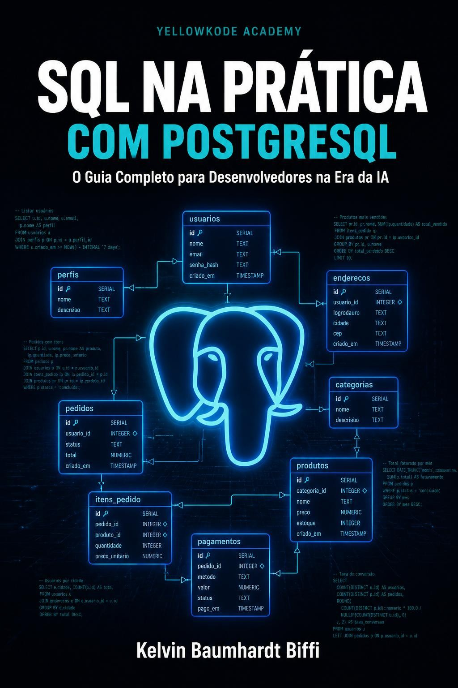

# SQL na Prática com PostgreSQL — Repositório de Referência

[](https://www.amazon.com.br/dp/B0H6688KL4)

> **[Disponivel na Amazon.com.br](https://www.amazon.com.br/dp/B0H6688KL4)** — R$24,97

---

Scripts SQL testados do livro [SQL na Prática com PostgreSQL](https://www.amazon.com.br/dp/B0XXXXX) (YellowKode Academy).

## Pré-requisitos

- [Docker Desktop](https://www.docker.com/products/docker-desktop/) instalado e rodando

## Subindo o banco em 3 comandos

```bash
# 1. Clone o repositório
git clone https://github.com/YellowKode-Academy/sql-na-pratica.git
cd sql-na-pratica

# 2. Suba o PostgreSQL 16 com Docker
docker compose up -d

# 3. Verifique se subiu
docker exec sql-guia-postgres pg_isready -U sqladmin -d sqldemo
```

Aguarde a mensagem `sqldemo:5432 - accepting connections`.

## Executando os scripts

```bash
# Schema (tabelas, índices, views)
docker exec -i sql-guia-postgres psql -U sqladmin -d sqldemo < scripts/01_schema.sql

# Dados de exemplo (20 clientes, 16 produtos, 15 pedidos)
docker exec -i sql-guia-postgres psql -U sqladmin -d sqldemo < scripts/02_seed.sql
```

## Conectando com um cliente SQL

| Campo    | Valor         |
|----------|---------------|
| Host     | localhost     |
| Port     | 5432          |
| Database | sqldemo       |
| User     | sqladmin      |
| Password | sqladmin123   |

Clientes compatíveis: [DBeaver](https://dbeaver.io/), [pgAdmin](https://www.pgadmin.org/), [TablePlus](https://tableplus.com/), ou `psql` no terminal.

## Scripts por capítulo

| Script | Capítulo |
|--------|----------|
| `01_schema.sql` | Cap. 1 — DDL e Modelo de Dados |
| `02_seed.sql` | Cap. 1 — Dados de exemplo |
| `03_select_basico.sql` | Cap. 2 — SELECT |
| `04_joins.sql` | Cap. 3 — JOINs |
| `05_agregacao.sql` | Cap. 4 — Agregação |
| `06_window_functions.sql` | Cap. 5 — Window Functions |
| `07_subqueries_cte.sql` | Cap. 6 — Subqueries e CTEs |
| `08_dml_transacoes.sql` | Cap. 7 — DML e Transações |
| `09_indices_performance.sql` | Cap. 8 — Índices e Performance |
| `10_sql_ia.sql` | Cap. 9 — SQL na Era da IA |

## Encerrando

```bash
docker compose down
```

Para remover os dados também: `docker compose down -v`
